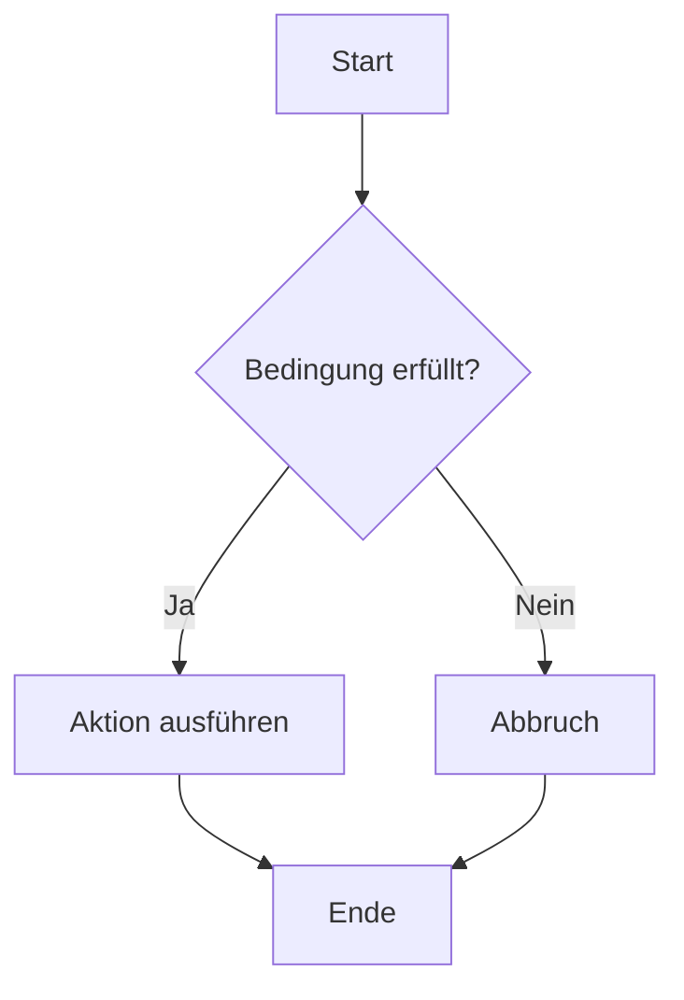

# GitHub Workshop

[🐞 Bug melden](https://github.com/GregorBiswanger/t-802-hello-github/issues/new?template=bug_report.md&labels=bug&title=Fehler%20gefunden)

Lorem ipsum

```bash
mkdir folder
cd folder
```

```javascript
console.log('Hello World');
```


